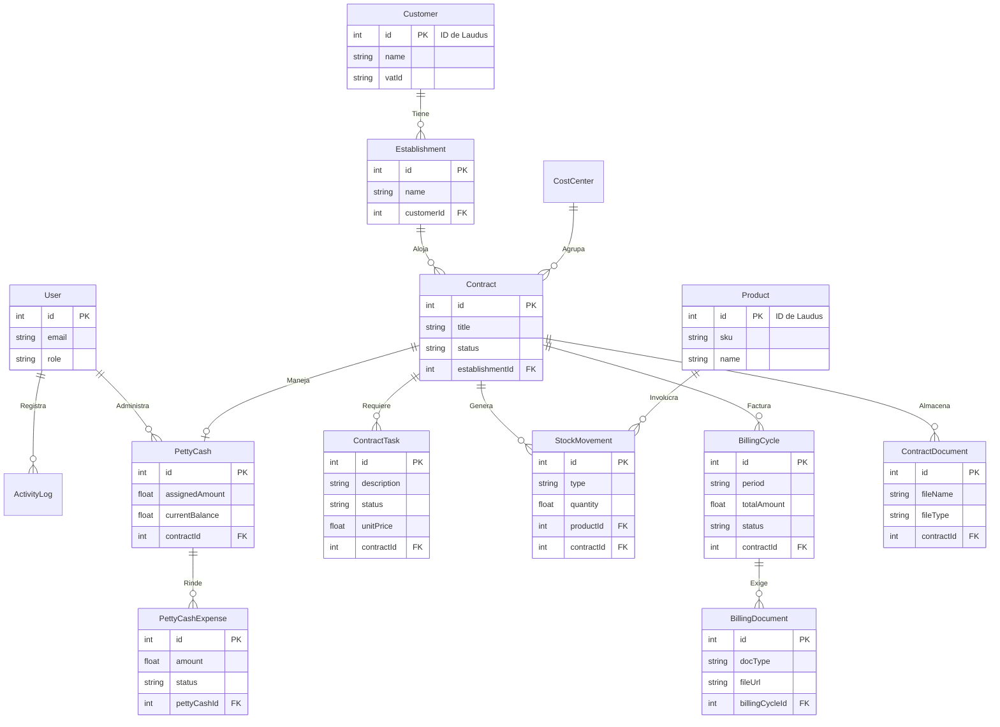

🗺️ Diagrama de Entidad-Relación (Base de Datos SGCL)

A continuación se muestra el mapa visual de cómo se conectan las tablas de la base de datos local.

```mermaid
erDiagram
    User ||--o{ ActivityLog : "Registra"
    User ||--o{ PettyCash : "Administra"
    Customer ||--o{ Establishment : "Tiene"
    Establishment ||--o{ Contract : "Aloja"
    CostCenter ||--o{ Contract : "Agrupa"
    Contract ||--o| PettyCash : "Maneja"
    Contract ||--o{ ContractTask : "Requiere"
    Contract ||--o{ StockMovement : "Genera"
    Contract ||--o{ BillingCycle : "Factura"
    Contract ||--o{ ContractDocument : "Almacena"
    PettyCash ||--o{ PettyCashExpense : "Rinde"
    BillingCycle ||--o{ BillingDocument : "Exige"
    Product ||--o{ StockMovement : "Involucra"

    User {
        int id PK
        string email
        string role
    }
    Customer {
        int id PK "ID de Laudus"
        string name
        string vatId
    }
    Establishment {
        int id PK
        string name
        int customerId FK
    }
    Contract {
        int id PK
        string title
        string status
        int establishmentId FK
    }
    ContractTask {
        int id PK
        string description
        string status
        float unitPrice
        int contractId FK
    }
    BillingCycle {
        int id PK
        string period
        float totalAmount
        string status
        int contractId FK
    }
    BillingDocument {
        int id PK
        string docType
        string fileUrl
        int billingCycleId FK
    }
    PettyCash {
        int id PK
        float assignedAmount
        float currentBalance
        int contractId FK
    }
    PettyCashExpense {
        int id PK
        float amount
        string status
        int pettyCashId FK
    }
    ContractDocument {
        int id PK
        string fileName
        string fileType
        int contractId FK
    }
    StockMovement {
        int id PK
        string type
        float quantity
        int productId FK
        int contractId FK
    }
    Product {
        int id PK "ID de Laudus"
        string sku
        string name
    }
```
